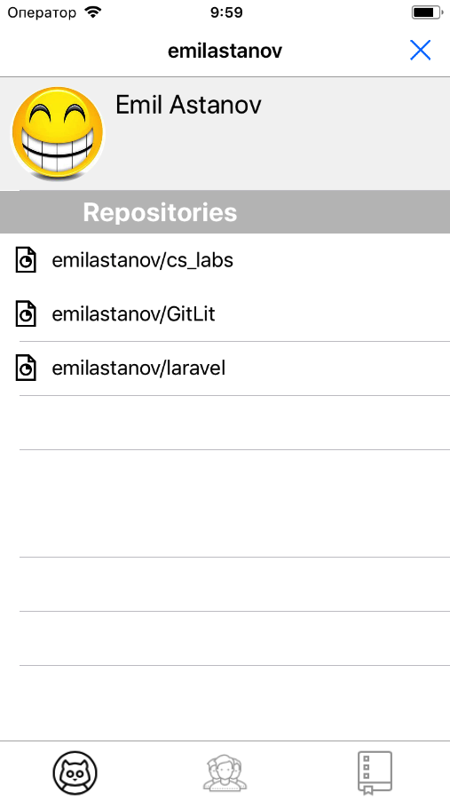
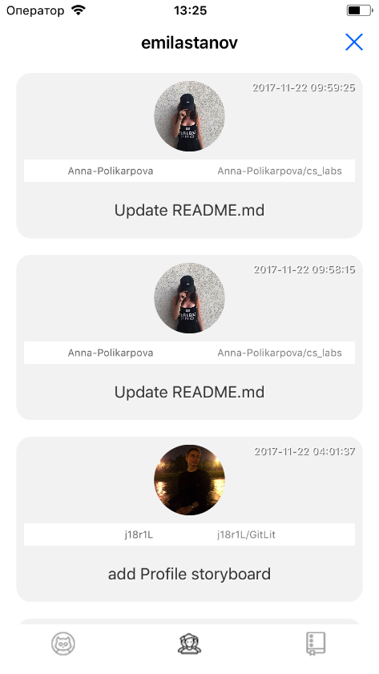
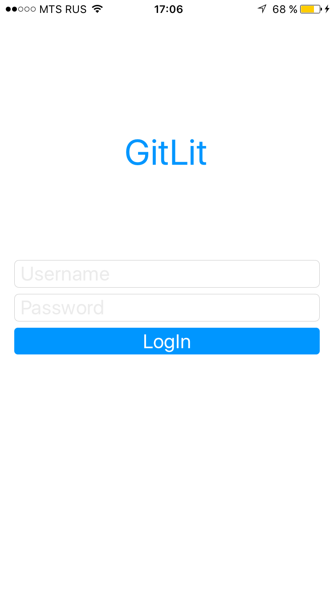
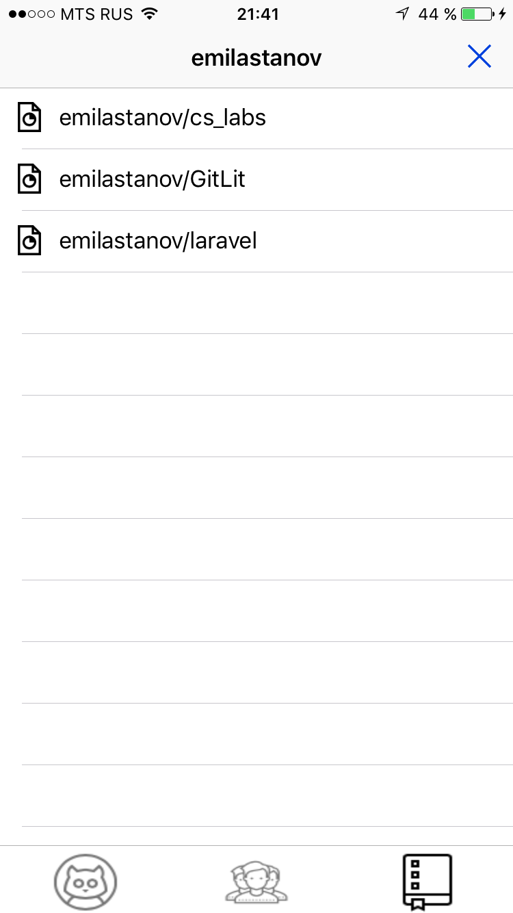
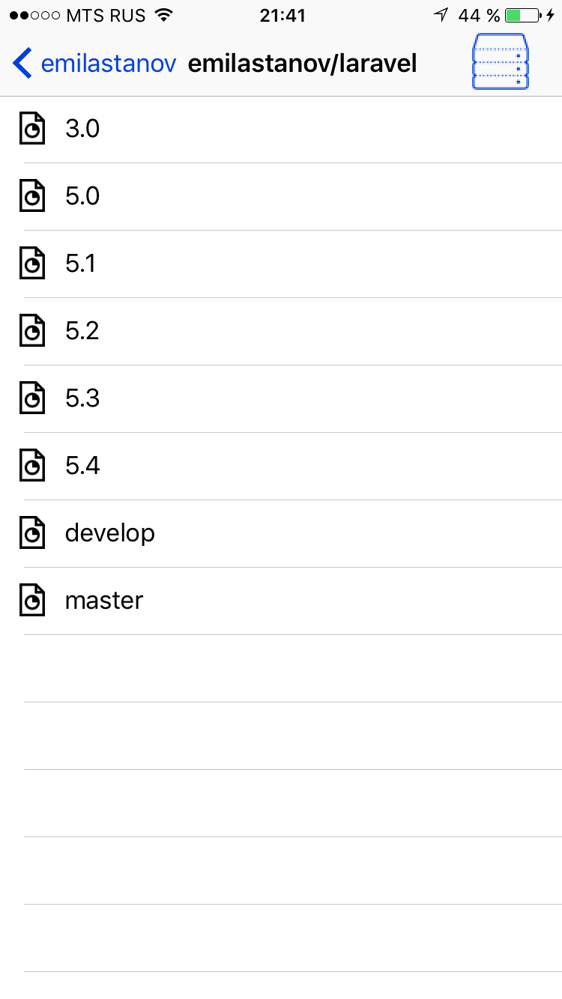
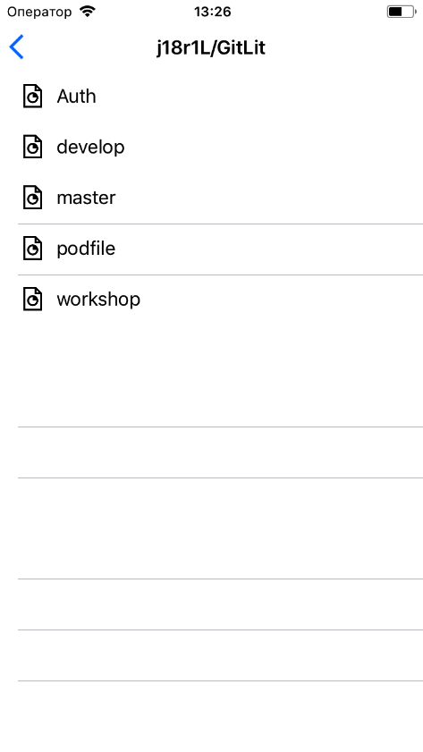

# GitLit

<h3>Тестовый пользователь:</h3>
 
<h4>login: gitlit2017</h4>
<h4>pass: qwerty1</h4>

GitLit -  приложение GitHub, которое содержит в себе большинство функций git-а, облегчая жизнь обычному ползователю.

Необходимость разработки: Часто мы не следим за обновлениями нашего гита, работая локально, GitLit будет оповещать push- уведомлениями о обновлении отследиваемой ветки или репозитория. Отсутсвие комментариев к выбранному участку кода заставляет команду разработчиков использовать мессенджеры, мы автоматизируем этот процесс, позволяя отправлять нужную часть кода в теллеграмм, используя сниппет.

CODE
Возможно отправлять нужный участок кода в телеграмм, с комментариями. Изменять код.

PROFILE SETTINGS
Возмодно изменять картинку профиля, статус, место работы (обучения)

<h3>Screenshots</h3>

